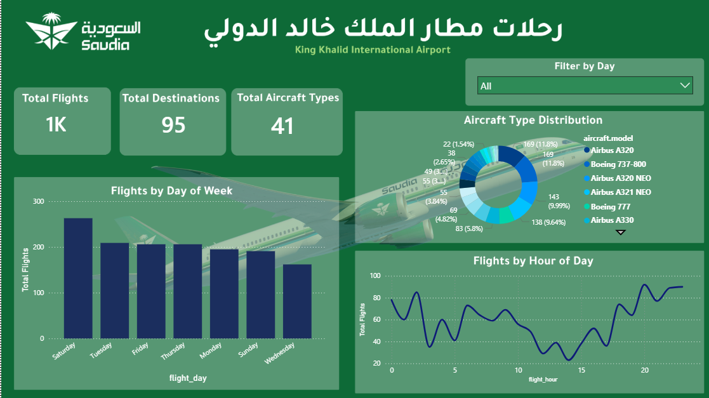
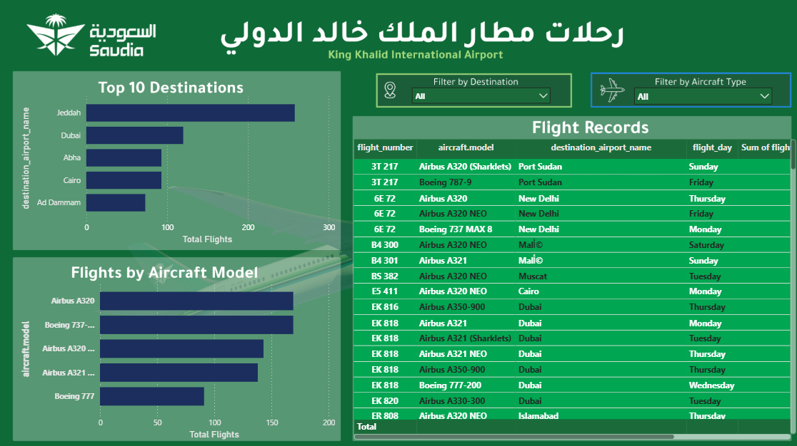

# King-Khalid-International-Airport-Flight-Analysis-Dashboard

This project focuses on developing an interactive Power BI dashboard to analyze flight operations at King Khalid International Airport. The workflow included data cleaning and transformation using Power Query, data modeling, and creating DAX measures to calculate key performance indicators (KPIs). The dashboard provides interactive visualizations for analyzing flight activity, destinations, aircraft types, and flight patterns across different days and hours.

The analysis enables comparisons between weekdays and peak operating hours, helping identify traffic trends, the most frequent destinations, and the most commonly used aircraft types. These insights support data-driven decision-making and operational planning through clear and interactive visualizations.

## Dashboard Highlights

- Total Flights
- Total Destinations
- Aircraft Type Distribution
- Flights by Day of Week
- Flights by Hour
- Top Destinations
- Flights by Aircraft Model
- Interactive Filters

## Tools

- Power BI
- Power Query
- DAX
- Excel
## Dashboard Preview

### Page 1

### Page 2

